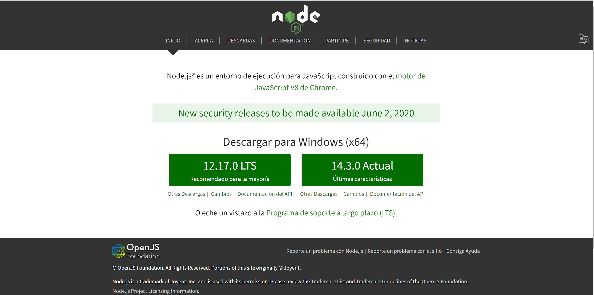
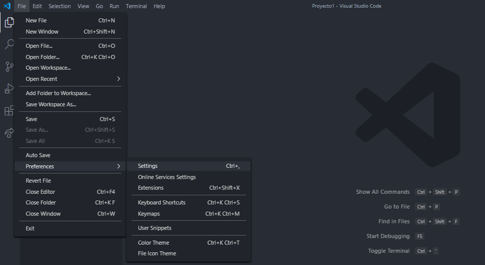
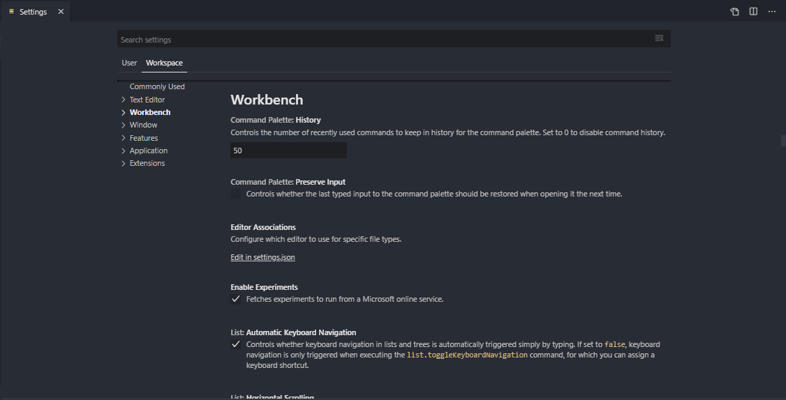
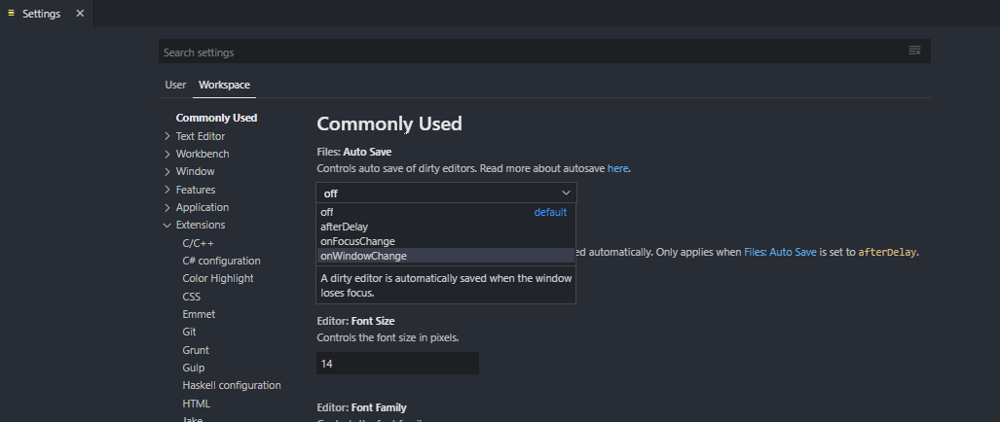
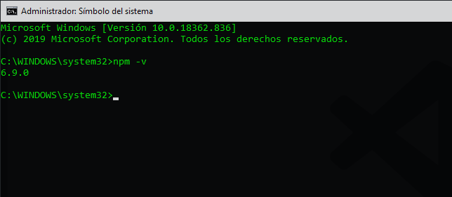
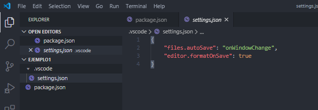
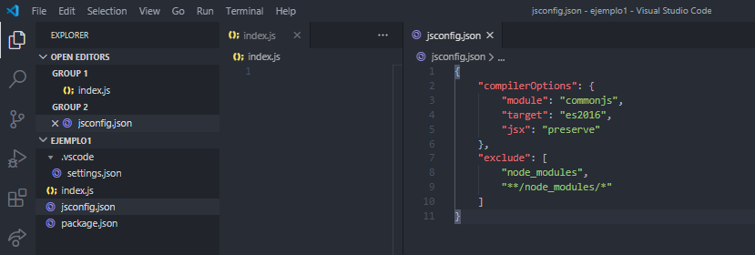
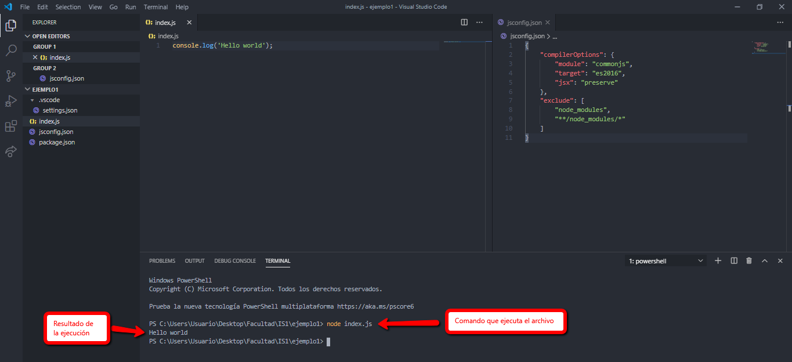
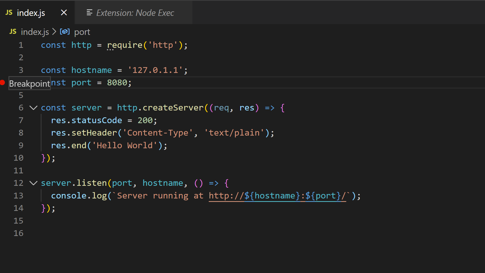
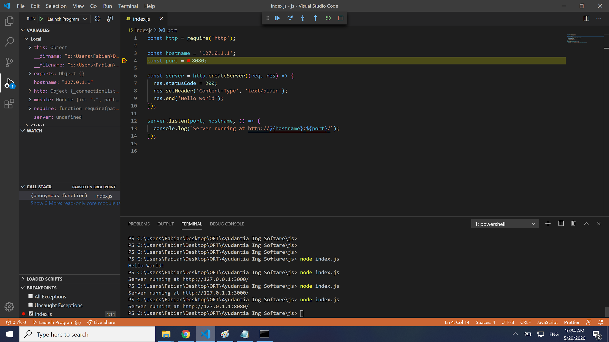

# **Instalación básica de VS Code**

Se utilizará el Visual Studio Code como IDE de preferencia para poder escribir todo el código del sistema. A continuación se deja el link de la instalación y se muestra como se descarga. [https://code.visualstudio.com/](https://code.visualstudio.com/)

Se elige la opción del sistema operativo que se utilice y se pone descargar.

Luego se ejecute la aplicación descargada y se pone siguiente hasta que se termine la descarga de la aplicación

Si esta todo bien, deberá abrir la aplicación y obtener el siguiente resultado.

**¿Por qué usar VS Code?**

Visual Studio Code es un editor multiplataforma Windows, Mac, Linux con reconocimiento de sintaxis de código y coloreado de una multitud de lenguajes e integración con Git. Los lenguajes soportados son varios, de los cuales destacan Javascript, C++, Objective C, PHP, Python, Ruby y SQL, soporta archivos individuales como HTML y CSS. También incorpora un debugger completo, y Microsoft está trabajando en depuraciones en CLR .NET y mono para todas las plataformas.

Si se quiere leer más sobre esta herramienta se deja un link a continuación

[https://code.visualstudio.com/docs](https://code.visualstudio.com/docs)

## **Runtime: Node.js**

Para poder utilizar todo js en Visual Studio Code se deberá descargar Node.Js. Node es un entorno en tiempo de ejecución multiplataforma, de código abierto basado en el lenguaje de programación JavaScript.

Para poder descargarlo simplemente acceder al link a continuacion y bajarse la version LTS [https://nodejs.org/es/](https://nodejs.org/es/)

Recomendamos bajar la versión 12.xx.x.

Una vez que se descargó la aplicación se deberá ejecutar el archivo descargado y poner siguiente hasta que se descargue completamente el archivo.

Para poder asegurar que se descargo bien el archivo simplemente abrir la consola de windows y escribir node -v para poder ver la versión que está en el sistema.

Se deja también un link a un video de youtube que explica todos los pasos nuevamente.

[https://www.youtube.com/watch?v=31dRWcPcvhM](https://www.youtube.com/watch?v=31dRWcPcvhM)

## **Workspaces**

Como desarrollador es importante saber configurar tu entorno de trabajo para ser lo más productivo posible, a su vez como parte de un equipo de desarrollo que trabaja en el mismo proyecto es importante compartir algunas configuraciones del entorno (principalmente las que afectan la generación y formateo del código).

Para estos dos puntos VS code plantea los conceptos de "User Settings" y “Workspace Settings”. Para acceder a estos debes ir a **File -> Preferences -> Settings ** o presionar **ctrl + , **

Una vez abierta esta sección verán los dos tipos de Settings mencionados arriba (User y Workspace):

Las configuraciones de User aplican a tu instalación del programa y se compartirán entre los distintos proyectos y archivos que abras.

En cambio las configuraciones de workspace aplican a la carpeta que tienes abierta, al hacer un cambio en estos settings se creará una carpeta llamada **.vscode **con un .json con estas configuraciones.

Por ejemplo si cambio la propiedad AutoSave:

Y luego abro el archivo **settings.json**:

Es importante destacar que las configuraciones de Workspace sobreescriben las de User.

Para más información sobre VS Code Settings se recomienda leer la siguiente página: [https://code.visualstudio.com/docs/getstarted/settings](https://code.visualstudio.com/docs/getstarted/settings)

## **Definición de proyecto Javascript (jsconfig.json)**

VS Code además de permitirnos hacer configuraciones generales del entorno nos permite hacer configuraciones específicas del lenguaje de programación que estemos usando.

En nuestro caso será **javascript**, el archivo que centralizará los settings del lenguaje se llama **jsconfig.json**.

Es importante tener definido este archivo ya que este define el contexto de los archivos javascript de un proyecto, haciendo que se ejecuten bajo las mismas reglas.

Para crear este archivo deben abrir un archivo con terminación **.js **y ejecutar **ctrl + shift + p **y escribir **javascript: Go to project configuration **:

Y seleccionar abajo a la derecha la opción para configurar un archivo **jsconfig.json**:

## 

Al seleccionar esa opción se creará el siguiente archivo con algunas configuraciones por defecto y al salvar quedará guardado en la ruta del proyecto.

Para más información sobre este archivo recomendamos leer las siguientes páginas:

[https://code.visualstudio.com/docs/languages/jsconfig](https://code.visualstudio.com/docs/languages/jsconfig)

[https://code.visualstudio.com/docs/nodejs/working-with-javascript](https://code.visualstudio.com/docs/nodejs/working-with-javascript)

## **Ejemplo**

Antes de continuar con la última sección sobre **debugging** vamos a presentar un ejemplo que integre lo explicado anteriormente.

Para este ejemplo vamos a tener que tener instalado **npm**, este programa es lo que se llama "Gestor de Paquetes" que permite la instalación y uso de librerías provistas por terceros de una forma sencilla.

Al instalar node js automáticamente se instala npm, por lo cual solamente procederemos a ejecutar en la consola **npm -v **para verificar que haya quedado instalado:

En caso de no haber quedado instalado verificar si node quedó correctamente instalado.

**npm **además es útil a la hora de crear un proyecto porque nos permite hacer los primeros pasos creando por nosotros un **package.json **el cual contiene las configuraciones de la aplicación.

Para iniciar un proyecto abriremos la consola e iremos a la carpeta en la cual crearemos el proyecto (en este caso **ejemplo1**), luego ejecutaremos **npm init**:

A continuación nos pide llenar algunos campos:

Y una vez finalizado nos crear el archivo package.json en la ruta del proyecto:

Procederemos a hacer algunas configuraciones útiles como son el Auto Save y el Format On Save:

Generándose el settings.json:

Ahora crearemos un archivo llamado **index.js **vacío el cual será el punto de entrada de nuestra aplicación y seguiremos los pasos especificados en la sección de definición del proyecto para crear el jsconfig.json.

A modo de prueba de node en el archivo index.js escribiremos una línea de código y la ejecutaremos por consola o por la terminal de VS code:

Por último haremos un ejemplo más avanzado tomado de la página de Node Js: [https://nodejs.org/en/docs/guides/getting-started-guide/](https://nodejs.org/en/docs/guides/getting-started-guide/)

Este ejemplo básicamente crea un servidor para nuestra aplicación el cual se le podrá hacer peticiones y podrá dar respuestas, en este caso escribirá "Hello World" en pantalla.

Y lo ejecutaremos:

Por último vamos a la URL del servidor:

## **Debugger**

Una vez realizado todos los pasos anteriores descargando VS Code, Node y sus respectivas extensiones simplemente queda probar el debug. La herramienta que nos permite ir línea por línea y ver el flujo que realiza nuestro código. Para eso primero que nada se marca con un breakpoint en alguna línea que se quiere debuggear como se muestra en la imagen.

Luego en la parte de Run → Start Debugging o con F5 se ejecuta el debug

Luego simplemente te va a pedir una configuración y dentro de las opciones se pone Node.js y luego empezará a funcionar el debug. En la ventana de la izquierda se puede observar como cambian las variables.

Las herramientas de arriba te permitirán navegar por el código utilizando el debug. En orden son Continue,Step Over,Step into, Step out, Restart, Stop.

Para más información acerca del debug simplemente haga clic en este link

[https://code.visualstudio.com/docs/nodejs/nodejs-debugging](https://code.visualstudio.com/docs/nodejs/nodejs-debugging)
