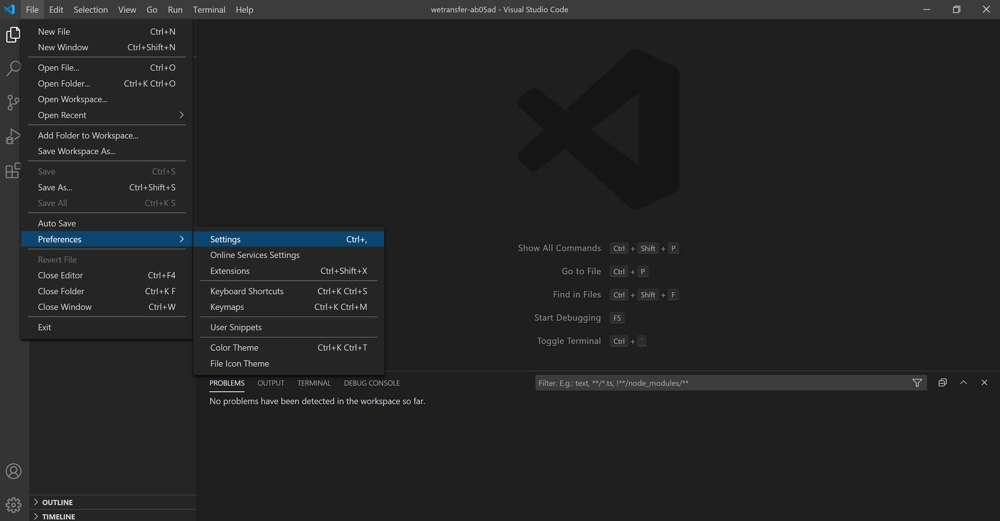
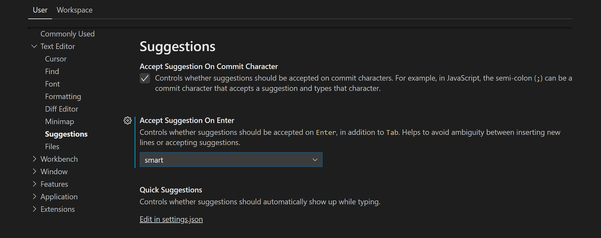
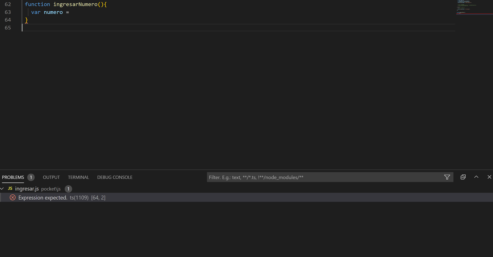
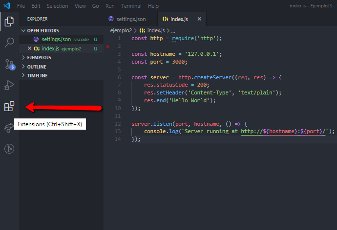
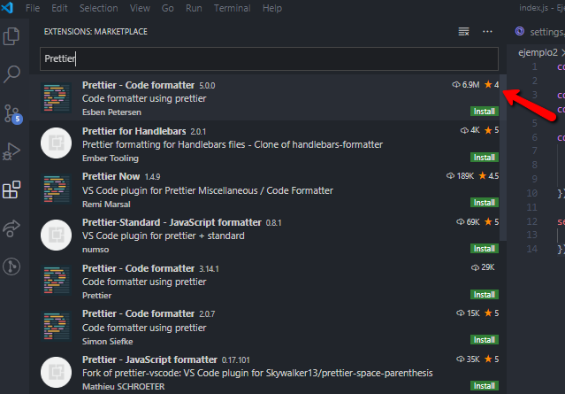
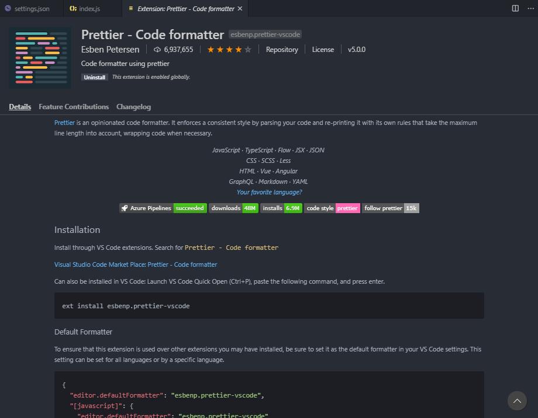
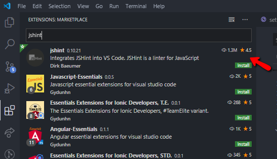

## **Google Style Guide (principales)**

### **Source file**

A continuación se explica puntos básicos relacionados al manejo de archivos en un proyecto javascript.

**Nombres de archivos:** Los archivos se nombran en lower case, utilizando como separador de cada palabra del nombre un guión o guión bajo. Cada archivo debe tener extensión \*\*.js\*\*.

Por ejemplo: **main.js**

**Convenciones al importar archivos**: A continuación se explican algunos puntos importantes al importar archivos.

- En los imports de archivos no es necesario colocar la extensión en el nombre del archivo pero es recomendable:

  `import '../directory/file'; -> No recomendado`

  `import '../directory/file.js'; -> Recomendado`

- No deberían haber varios imports del mismo archivo:

  `import {short1} from './long/path/to/a/file.js';`

  `import {short2} from'./long/path/to/a/file.js'; -> No recomendado`

  `import {short1,short2} from'./long/path/to/a/file.js';-> Recomendado`

- Nombres de módulos en imports: Al importar todo el contenido de un archivo utilizando \* y renombrar utilizando **as <nombre> **es recomendable que el nombre siga lower camel case:

  `import \* as libString from './lib/string.js';`

- Nombres de submódulos en imports: si necesitas importar un función de un archivo y sucede que esta ya está definida en el archivo actual se recomienda renombrarla en el import:

  `import {Cat as BigCat} from './biganimals.js';`

  `function Cat(){}`

  **Convenciones al exportar archivos**: A continuación se explican algunos puntos importantes al exportar archivos.

- default vs named exports: Al exportar todo el contenido de un archivo utilizando no se recomienda utilizar **default**.

  `// Do not use default exports:`

  `export default class Foo { ... } // BAD!`

  `// Use named exports:`

  `export class Foo { ... } -> Recomendado`

- Exportar clases y objetos estáticos: No es recomendable crear clases contenedoras para exportar todos los objetos de un archivo, para esto se recomienda exportar cada uno por separado:

  `/\*_ @return {number} _/`

  `export function bar() {`

  `return 1;`

  `}`

  `/\*_ another way to do the bar function using arrow functions _/`

  `export const bar1 = () => {`

  `return 1;`

  `}`

  `export const /\*_ number _/ FOO = 1;`

Por más información puedes consultar [https://google.github.io/styleguide/jsguide.html#source-file-basics](https://google.github.io/styleguide/jsguide.html#source-file-basics)

[https://google.github.io/styleguide/jsguide.html#source-file-structure](https://google.github.io/styleguide/jsguide.html#source-file-structure)

### **Naming**

A continuación se explica cómo se utiliza el correcto nombramiento de métodos, paquetes, clases y variables

**Nombres de Paquetes**: Los paquetes se escriben todos de la forma lowerCamelCase. Por ejemplo, my.exampleCode.deepSpace, y no my.examplecode.deepspace o my.example_code.deep_space

**Nombres de Clase**: Clases, interfaces y typedef nombres son escritos con UpperCamelCase.Por ejemplo, ClaseVendedor, y no claseVendedor o Clase_Vendedor.

**Nombre Métodos**: Los métodos se escriben también con lowerCamelCase al igual que los nombres de los paquetes. Los nombres de los métodos son comúnmente verbos o frases. Por ejemplo mandarMensaje.

**Nombre de Variables**: Las variables locales, parámetros y variables no constantes todos se escriben de la forma lowerCamelCase.Por ejemplo var numeroPagina = 1. Variables constantes usan CONSTANT_CASE: todas las letras en mayúscula separadas por un guión. Ejemplo const NUMBER = 5

Mas informacion sobre como se nombra [https://google.github.io/styleguide/jsguide.html#naming](https://google.github.io/styleguide/jsguide.html#naming)

### **Formatting**

A continuación se explica cómo se utiliza el correcto formateo de métodos,

**Los paréntesis se utilizan en todas las estructuras de control**: Los paréntesis son necesarios en todas las estructuras de control\*\* \*\*(if, else, for, do, while, como en otras), aun si son un línea de declaración. Ejemplo: if (unaCondicionLarga()) , hacerAlgo(); , for (let i = 0; i < foo.length; i++) bar(foo[i]);

**Bloques Vacíos**: Un bloque vacío puede ser cerrado inmediatamente después de abrirse sin caracteres espacios o separación de línea como por ejemplo al usar los {}. Ejemplo: function moverAlgo(){}.

**Sentencias:**

- Una sentencia por línea: Cada sentencia es seguida por un salto de línea;

- Punto y coma: Al terminar cada sentencia se necesita poner un punto y coma

- Máximo de caracteres: Una sentencia no puede tener más de 80 caracteres.

**Comentarios**: Bloques de comentarios son indentados igual que el codido de sus alrededor. Se utiliza la siguiente estructura para hacer muchos comentarios /_ ... _/ o // para hacer una línea de comentario.

#### Ejemplo

`/* Se deja comentario`
`mas informacion`
`*/`

`// Se deja un comentario`

Mas informacion de Formatting [https://google.github.io/styleguide/jsguide.html#formatting](https://google.github.io/styleguide/jsguide.html#formatting)

## **Uso de estándares en VS Code**

Para poder aprovechar al máximo la herramiento de Visual Studio Code y poder seguir los estándares de la mejor manera se va a configurar ciertas propiedades que VS Code nos permite usar sin la necesidad de plugins. Para eso abrir la pestaña de Settings que se encuentra en la parte de File→Preferences→ Settings

En la parte de setting vamos a donde dice Suggestion. Seleccionas a la primera opción en true que nos permite agregar punto y coma al final de cada sentencia si te olvidas.

Luego en Quick Suggestion vamos a poner en el link de edit in settings.json en donde vamos a poner en true a esta opción para que nos diga sugerencia de forma automática que nos permite seguir los estándares.

En la imágen hay dos Tabs dónde hacer la configuración (User y Workspace), recomendamos realizar las configuraciones en Workspace para que quede a nivel de proyecto y ser consistente con nuestros compañeros.

## **Manejo de problemas en VS Code**

Algo que nos puede ayudar mucho mejorar nuestro código en Vs Code es el Problem Panel, estese se activa cuando ocurre algún error en el código y por lo tanto al ejecutar puede no ser interpretado correctamente.
Simplemente se va al problem pane mediante Views -> Problems y se obtiene el error que encontró

Para poder ver qué significa ese error en específico ver la documentación de errores para poder entenderlo y poder resolverlo.

## **Extensiones básicas, Prettier y Linters**

Como hemos ejemplificado en los puntos anteriores, es muy importante conocer los estándares del lenguaje en el que estemos programando, esto hará que nuestro código mejore siendo más legible, mantenible a futuro y traspasable entre distintos programadores del proyecto.

Definir qué convenciones utilizar no es una tarea fácil, dado que cada programador puede tener opiniones fuertes sobre cada punto y probablemente cada uno tenga un poco de razón dado que se han enfrentado a distintas problemáticas en su experiencia.
Para evitar discusiones y burocracia innecesaria es útil usar extensiones que brinda la comunidad para potenciar nuestros entornos de desarrollo.

Nosotros nos vamos a centrar en dos tipos de extensiones: extensiones de linter, extensiones de formateo.

#### Linter

Este tipo de extensiones nos ayudan a respetar el código de estilo definido a principio del proyecto.

Ejemplos de estas son:

- [StandardJS](https://marketplace.visualstudio.com/items?itemName=chenxsan.vscode-standardjs)

- [JSHint](https://marketplace.visualstudio.com/items?itemName=dbaeumer.jshint)
  Esta es la que recomendamos usar en sus proyectos dado que tiene una gran comunidad detrás con una gran cantidad de descargas.

#### Formateo

A veces escribimos código que no está acorde con el resto del código, en ocasiones es porque estamos haciendo una prueba básica y rápida para ver si algo funciona y no lo hacemos del todo prolijo.

Para ayudarnos en esto, necesitamos volver atrás y corregir la sangría en cada línea, asegurarnos de que las llaves y las etiquetas estén formateadas correctamente en un formato legible.

Este proceso puede volverse tedioso rápidamente.

Para esto existen este tipo de extensiones que brindan funcionalidades que nos facilitan el desarrollo.

Ejemplos de estas son:

- [Prettier](https://marketplace.visualstudio.com/items?itemName=esbenp.prettier-vscode):
  Esta es la que recomendamos utilizar por razones similares a las comentadas arriba.

- [Beautify](https://marketplace.visualstudio.com/items?itemName=HookyQR.beautify)

#### Instalación

Para instalar cualquier extensión hay que ir a la sección de Extensions en el menú laterial:

Al seleccionar esta sección se mostrará lo siguiente:

Primero instalaremos Prettier. Si encuentran extensiones con el mismo nombre deben priorizan los que tienen mayor cantidad de descargas.

Deberán seleccionar install lo que abrirá la siguiente página. Recomendamos leer la página de detalle porque explica como usar la extensión y todas sus funcionalidades:

Como hemos comentado en la guía 1, desde el settings de visual studio se pueden configurar los settings de las extensiones:

**<No estoy seguro si esta sea la mejor extensión>**

Haremos lo mismo con JSHint:

Como comentamos arriba se recomienda seguir la guía de instalación documentada en la extensión.
