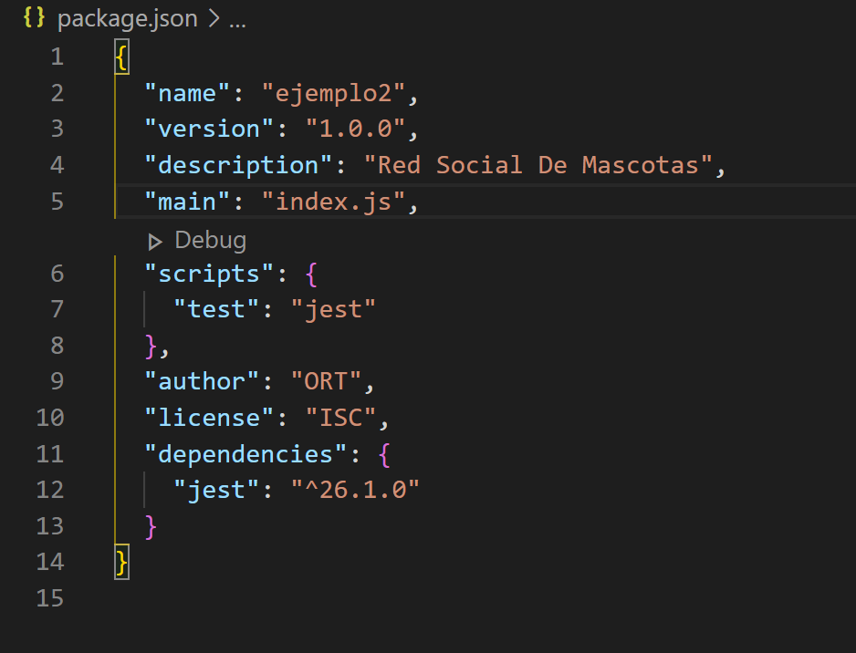
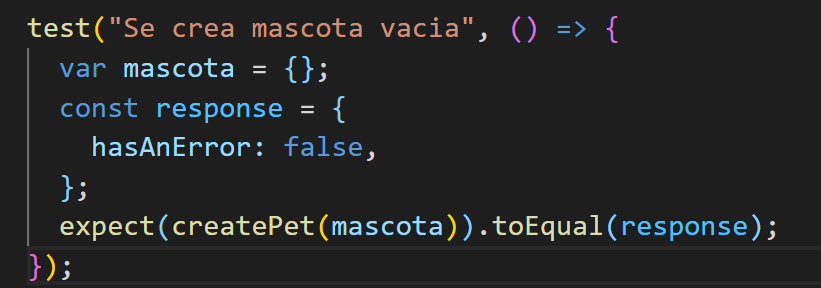
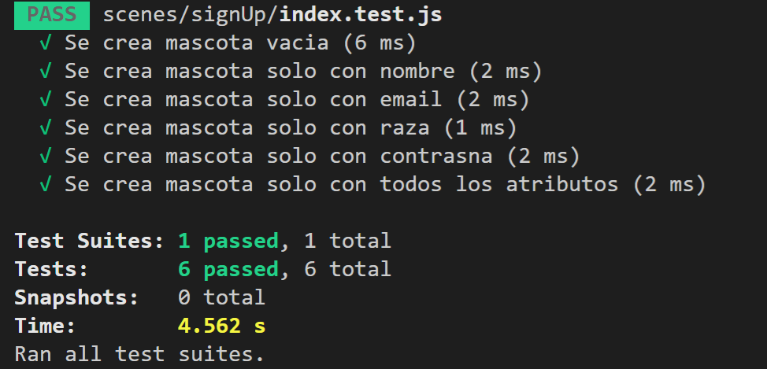
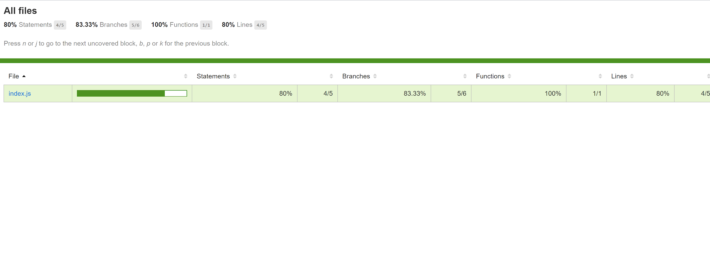
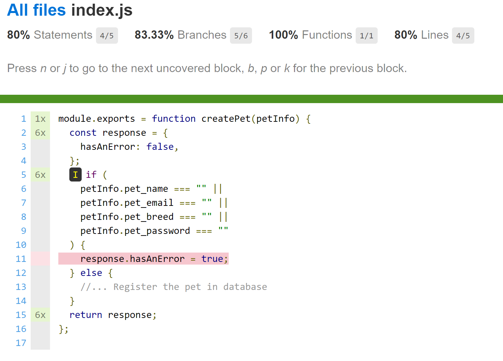
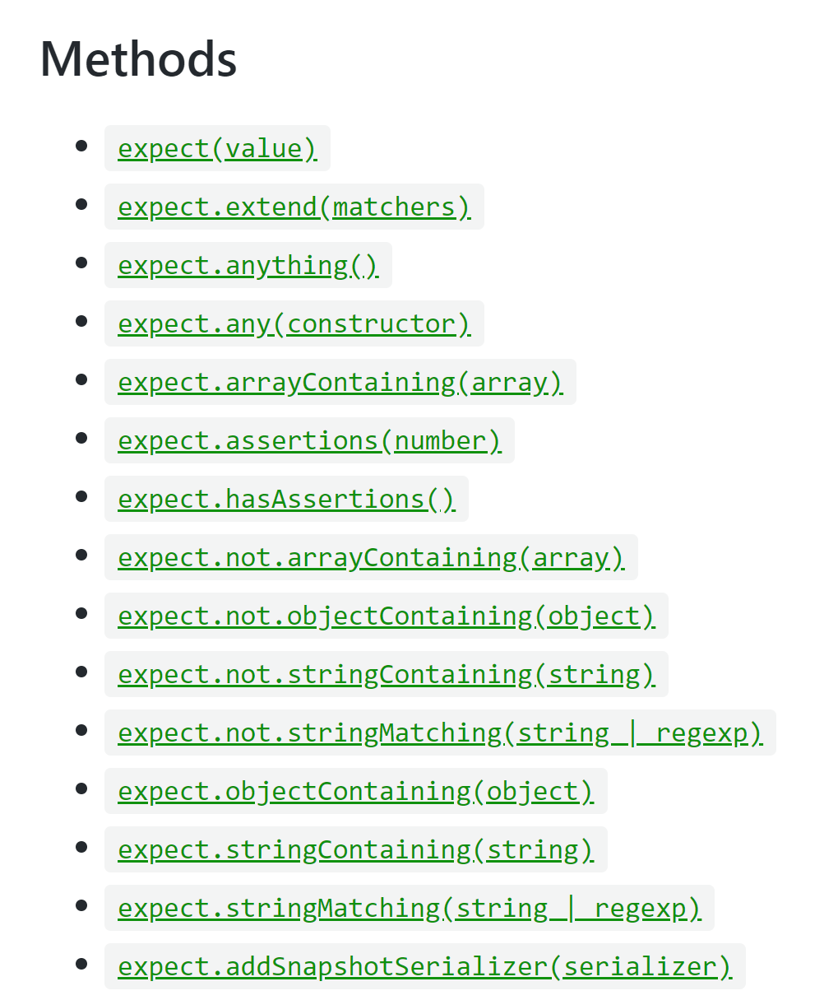

**Unit Test**

**Qué es y porqué hacer pruebas unitarias?** Las pruebas unitarias o Unit testing forman parte de los diferentes procedimientos que podemos llevar a cabo en la metodología ágil. Principalmente, son trozos de código diseñados para comprobar que el código principal está funcionando como esperábamos. Son pequeños test creados específicamente para cubrir todos los requisitos del código y verificar sus resultados.

**Motivos para realizar un test unitario**

- Si todavía no estás del todo seguro de por qué debes incorporar las unit testing a tu día a día como desarrollador, te damos algunos motivos:

- Las pruebas unitarias demuestran que la lógica del código está en buen estado y que funcionará en todos los casos.

- Aumentan la legibilidad del código y ayudan a los desarrolladores a entender el código base, lo que facilita hacer cambios más rápidamente.

- Los test unitarios bien realizados sirven como documentación del proyecto.

- Se realizan en pocos milisegundos, por lo que podrás realizar cientos de ellas en muy poco tiempo.

Mas informacion sobre las pruebas unitarias: [http://ramonabadypuntonet.org/2017/04/01/que-son-los-unit-test/](http://ramonabadypuntonet.org/2017/04/01/que-son-los-unit-test/)

**Diseño de casos de uso**: Como se menciona anteriormente se va a querer realizar pruebas para todas las funciones creadas en el sistema. Se pretende que para cada una de las función se realicen pruebas unitarias que contemplen todos los casos bordes,es decir todas las posibles entradas que pueda recibir esa función para asegurar que para todas está la función se comporta de la forma correcta. Poniendo como ejemplo la función createPet se pregunta antes de ingresarlo si todos los campos no son vacíos. Para hacemos 6 pruebas en donde en una se encuentran todos los datos y en las otros varia que atributo no se encuentra vacío.

**Instalación y uso de Jest**

Para realizar las pruebas unitarias en javascript se va utilizar la herramienta jest que no permite realizar y verificar las pruebas que nosotros nos creemos.

[https://jestjs.io/docs/en/getting-started.html](https://jestjs.io/docs/en/getting-started.html)

Paso 1) Escribir en la terminal npm install --save-dev jest

Paso 2) Escribir en package.json en la parte de test, test.

Paso 3) Crear una clase que es la que va a tener los test con la extensión .test.js

Paso 4) Agregar el requiere de el archivo js que se quieren hacer test unitarios

Paso 5) Crear el test. Se pone primero el nombre de lo que se quiere testear y luego se escribe la aprueba. Se pone .toEqual para comparar resultados como en el ejemplo. Por mas informacion sobre distintos tipos de pruebas [https://jestjs.io/docs/en/mock-functions](https://jestjs.io/docs/en/mock-functions)

Paso 6) Ejecutar el comando por terminal de npm test para ejecutar todas las pruebas.

Si se quisiera obtener un resumen en más profundidad de se puede utilizar la función coverage que nos da como resultado un reporte de nuestros test. Para eso vamo a package.json y en la parte de test agregamos --coverage y luego volvemos a ejecutar los test.

Además te genera automáticamente un index,html en donde se puede ver con más detalles el reporte de la cobertura y donde están las ramas que no fueron utilizadas. Para eso simplemente ir a la carpeta coverage (autogenerada) y abrir el index.html

**Tipos de Assert**

Se puede usar también utilizar distintos métodos que nos ayudan a verificar distintas condiciones cuando hacemos los test

Para más información sobre más métodos y que hacen cada uno leer el siguiente link [https://jestjs.io/docs/en/expect](https://jestjs.io/docs/en/expect)
